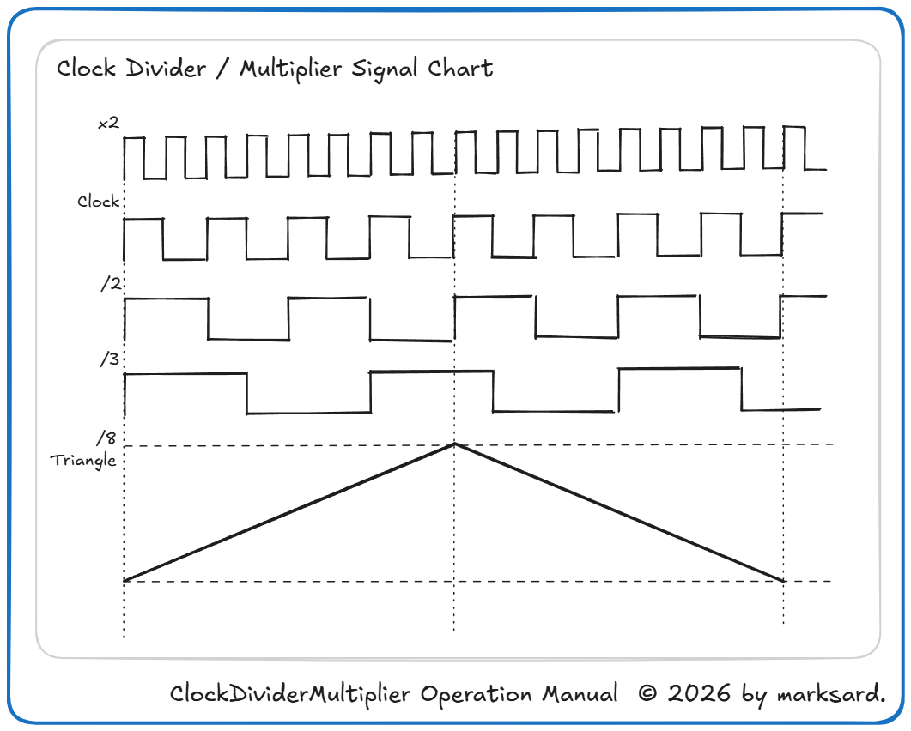

# Clock Divider / Multiplier 操作マニュアル

## 目次

1. [はじめに](#1-はじめに)
2. [ClockDividerMultiplier](#2-ClockDividerMultiplier)
    - 2.1 [入出力の割り当て](#21-入出力の割り当て)
    - 2.2 [操作方法](#22-操作方法)
    - 2.3 [動作解説](#22-動作解説)
3. [免責事項](#9-免責事項)
4. [改版履歴](#10-改版履歴)

## 1-はじめに

TriggerHappyはRP2040マイコンを搭載したユーロラック・モジュール用の多機能トリガー／ゲート／CVジェネレーターです。  
本ファームウェアはTriggerHappy上で動作します。  

TriggerHappyのハードウェア概要、基本操作、ファームウェア書き換え方法などはTriggerHappyマニュアルを参照ください。  
[TriggerHappy Operation Manual](https://github.com/marksard/TriggerHappy/blob/main/app/TriggerHappy/manual/TriggerHappyOperationManual.pdf)  

---

## 2-ClockDividerMultiplier

本ファームウェアは以下の機能を備えています。  

1. クロック分割機能：クロック入力を分割し、クロック/2、クロック/3…のタイミングでトリガーを出力します。
1. クロック乗算機能：クロック入力を乗算し、クロックx2、クロックx3…のタイミングでトリガーを出力します。
1. 3出力x2パラ構成：OUT1~3をGroupA、OUT4~6をGroupBの2系統とし別々のクロックで動作します。GroupB用のトリガー入力が未使用ならGroupAと連動します。
1. シンクLFO機能：クロック入力を分割・乗算し、それを1周期とするLFOを出力します。

### 2.1-入出力の割り当て

- 入力
  - `CLOCK` Group A（OUT1~3）用クロック入力
  - `RESET` リセット入力（Group A / B共通）
  - `DATA` Group B（OUT4~6）用クロック入力
- 出力
  - `OUT1~3` Group A出力トリガー出力
  - `OUT4~6` Group B出力トリガー出力
  - `CV` シンクLFO出力（0~5V範囲）

### 2.2-操作方法

- `B` 出力設定の選択（OUT1:暗緑,2:明緑,3:暗黄,4:明黄,5:暗赤,6:明赤,CV=明青）
- `A` 出力設定の選択（OUT1:暗緑,2:明緑,3:暗黄,4:明黄,5:暗赤,6:明赤,CV=明青）
- `MODE` OUT1~6出力のゲート出力・トリガー出力を切り替え（各出力LEDで光る時間が変わって確認できます）
- `ロータリーエンコーダー押し込み` 手動リセット
- `ロータリーエンコーダー` 選択された出力のクロックに対する分割数、乗算数を選択します（各出力LEDで光る間隔が変わることで確認できます。後述）
- `A長押し`+`ロータリーエンコーダー` シンクLFOの波形を選択します（LEDの光りかたで確認できます。種類は後述）
- `B長押し`+`ロータリーエンコーダー` なし

---

### 2.3-動作解説

#### クロック分割・乗算

　クロック入力に外部信号を接続すると分割選択時はクロックを間引き、乗算選択時はクロック立ち上がり間隔からの演算でトリガーを出力します。  
　出力はトリガーかゲート（クロック立ち上がり間隔の50%）から選択できます。  
　Group B（DATA）入力に2秒程度入力がない場合、Group A（CLOCK）側に連動して動作します。  
　Group Aの出力をGroup Bのクロックとして使うことで、選択可能な分割数、乗算数を超える設定なども設定できます。（ただしクロック入力上限は~10kHz前後です）  

#### シンクLFO

　クロック入力（Group A側のCLOCK入力と連動）に外部信号を接続すると分割選択時はクロックを間引き、乗算選択時はクロック立ち上がり間隔からの演算で、その間隔を1周期とする波形を0~5Vの範囲で出力します。  
　波形はノコギリ1/ノコギリ2/三角波/矩形波から選択できます。  

#### クロックに対する分割数、乗算数設定範囲

以下を選択できます。  

|トリガー|シンクLFO|
|:--:|:--:|
|-|÷256|
|-|÷128|
|÷64|÷64|
|÷32|÷32|
|÷16|÷16|
|÷12|÷12|
|÷8|÷8|
|÷7|÷7|
|÷6|÷6|
|÷5|÷5|
|÷4|÷4|
|÷3|÷3|
|÷2|÷2|
|÷1|÷1|
|*2|*2|
|*3|*3|
|*4|*4|
|*5|-|
|*6|-|
|*7|-|
|*8|-|
|*12|-|
|*16|-|

#### 各出力のデフォルト設定

|出力|分/乗|設定|
|:--:|:--:|:--:|
|OUT1|÷1|ゲート|
|OUT2|÷2|ゲート|
|OUT3|÷4|ゲート|
|OUT4|÷3|ゲート|
|OUT5|÷5|ゲート|
|OUT6|÷7|ゲート|
|シンクLFO|÷64|三角波|

---

## 3.-免責事項

### 品質・動作保証について

本モジュールは十分な検証を行っておりますが、全ての環境において正常に動作することを保証するものではありません。  
本モジュールの使用によって発生したいかなる損害（直接的・間接的を問わず）について、開発者および販売者は責任を負いません。  

### 技術的サポートについて

本モジュールに関するサポートは可能な範囲で提供しますが、商業製品のような継続的なサポートや保証をお約束するものではありません。  
お問い合わせへの対応は任意で行われ、必ずしもすべての問題に対応できるとは限りません。  

### 安全性について

本モジュールは十分な注意をもって設計されていますが、使用環境や誤った取り扱いによって事故が発生する可能性があります。  
適切に注意を払い自己責任にてご使用ください。  

### 免責事項の変更について

必要に応じて免責事項を変更する場合があります。  

---

## 4.-改版履歴
- 2026-08-06 初版

<footer style="text-align:center; font-size:12px; margin-top:50px;">
Clock Divider / Multiplier Operation Manual  © 2026 by marksard.
</footer>
