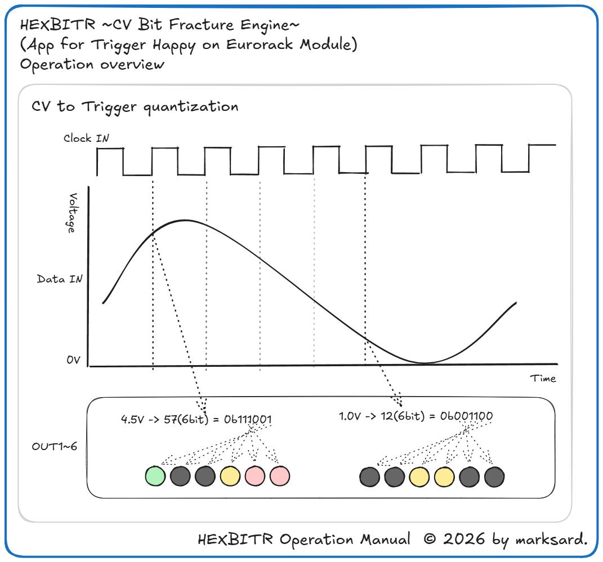
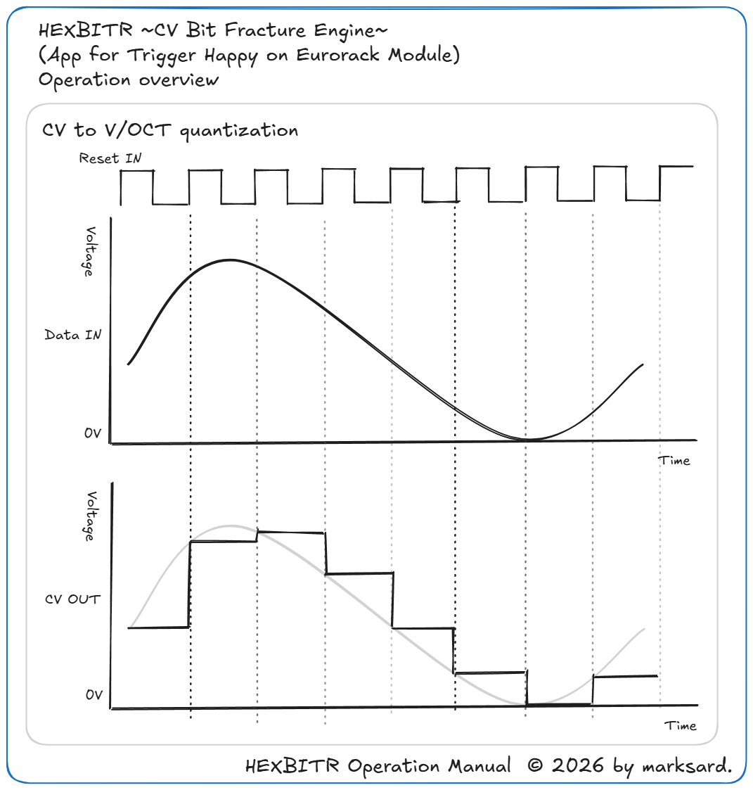

# HexBitr 操作マニュアル

## 目次

1. [はじめに](#1-はじめに)
2. [HEXBITR](#2-HEXBITR)
    - 2.1 [入出力の割り当て](#21-入出力の割り当て)
    - 2.2 [操作方法](#22-操作方法)
    - 2.3 [動作解説](#22-動作解説)
3. [免責事項](#9-免責事項)
4. [改版履歴](#10-改版履歴)

---

## 1-はじめに

TriggerHappyはRP2040マイコンを搭載したユーロラック・モジュール用の多機能トリガー／ゲート／CVジェネレーターです。  
HEXBITRはTriggerHappy上で動作するアプリケーションです。  

TriggerHappyのハードウェア概要、基本操作、ファームウェア書き換え方法などはTriggerHappyマニュアルを参照ください。  
[TriggerHappy Operation Manual](https://github.com/marksard/TriggerHappy/blob/main/app/TriggerHappy/manual/TriggerHappyOperationManual.pdf)  

---

## 2-HEXBITR

本アプリケーションは以下の機能を備えています。  

1. CV量子化トリガー：クロック入力でCV入力を6bit量子化しビットごとにトリガー出力します。
1. V/OCTクオンタイザー：上記とは別のクロック入力でCV入力をV/OCTクオンタイズ＆ホールド出力します。

### 2.1-入出力の割り当て

- 入力
  - `CLOCK` CV量子化トリガー用クロック入力
  - `RESET` V/OCTクオンタイザー用クロック入力
  - `DATA` CV入力（0~5V範囲）
- 出力
  - `OUT1~6` 6bit出力
  - `CV` V/OCTクオンタイザー出力

### 2.2-操作方法

- `B` 次のchのゲート・トリガー設定を選択（エンコーダーLEDが各ch出力LEDと同色に変化します）
- `A` 前のchのゲート・トリガー設定を選択（エンコーダーLEDが各ch出力LEDと同色に変化します）
- `MODE` 選択されたchのゲート出力・トリガー出力を切り替え（各ch出力LEDで光る時間が変わって確認できます）
- `ロータリーエンコーダー` 全chのゲート長さを選択します（7段階）
- `A長押し`+`ロータリーエンコーダー` V/OCTクオンタイザー出力のオクターブ範囲を設定します（5段階）
- `B長押し`+`ロータリーエンコーダー` V/OCTクオンタイザー出力のスケールを設定します（メジャー/ナチュラルマイナー）

---

### 2.3-動作解説

#### CV量子化トリガー

　LFOやノイズなどをCV入力に接続、ゲートかトリガーをCLOCK入力に接続すると、CLOCK入力の立ち上がりでCV入力を6bit値でサンプリング、そのbitをOUT1~6に割り当ててゲートとして出力します。  
　CV入力は0~5V範囲を認識するので、適宜オフセット付きのアッテネータなどを挟んで調整してください。
　全chの出力ゲート長さはロータリーエンコーダー操作で変更出来ます。トリガーのような短いパルスから、CLOCK立ち上がり間隔(100%)まで伸ばせます。  
　また、A/Bボタンでchを選択、MODEを押すとゲート出力を100% or 全ch出力ゲート長さに切り替えられます。  

---

#### V/OCTクオンタイザー

　LFOやノイズなどをCV入力に接続、ゲートかトリガーをRESET入力に接続すると、RESET入力立ち上がりでCV入力をサンプリング、V/OCTスケールに変換しCV出力します。  
　CV入力は0~5V範囲を認識するので、適宜オフセット付きのアッテネータなどを挟んで調整してください。
　Aボタンを押しながらロータリーエンコーダーを回すことで、サンプリングの波高を何オクターブ範囲にマッピングするかを変更できます。  
　Bボタンを押しながらロータリーエンコーダーを回すことでスケールを変更できます。  

  ---

## 3.-免責事項

### 品質・動作保証について

本モジュールは十分な検証を行っておりますが、全ての環境において正常に動作することを保証するものではありません。  
本モジュールの使用によって発生したいかなる損害（直接的・間接的を問わず）について、開発者および販売者は責任を負いません。  

### 技術的サポートについて

本モジュールに関するサポートは可能な範囲で提供しますが、商業製品のような継続的なサポートや保証をお約束するものではありません。  
お問い合わせへの対応は任意で行われ、必ずしもすべての問題に対応できるとは限りません。  

### 安全性について

本モジュールは十分な注意をもって設計されていますが、使用環境や誤った取り扱いによって事故が発生する可能性があります。  
適切に注意を払い自己責任にてご使用ください。  

### 免責事項の変更について

必要に応じて免責事項を変更する場合があります。  

---

## 4.-改版履歴
- 2026-05-29 初版

<footer style="text-align:center; font-size:12px; margin-top:50px;">
HEXBITR Operation Manual  © 2026 by marksard.
</footer>
