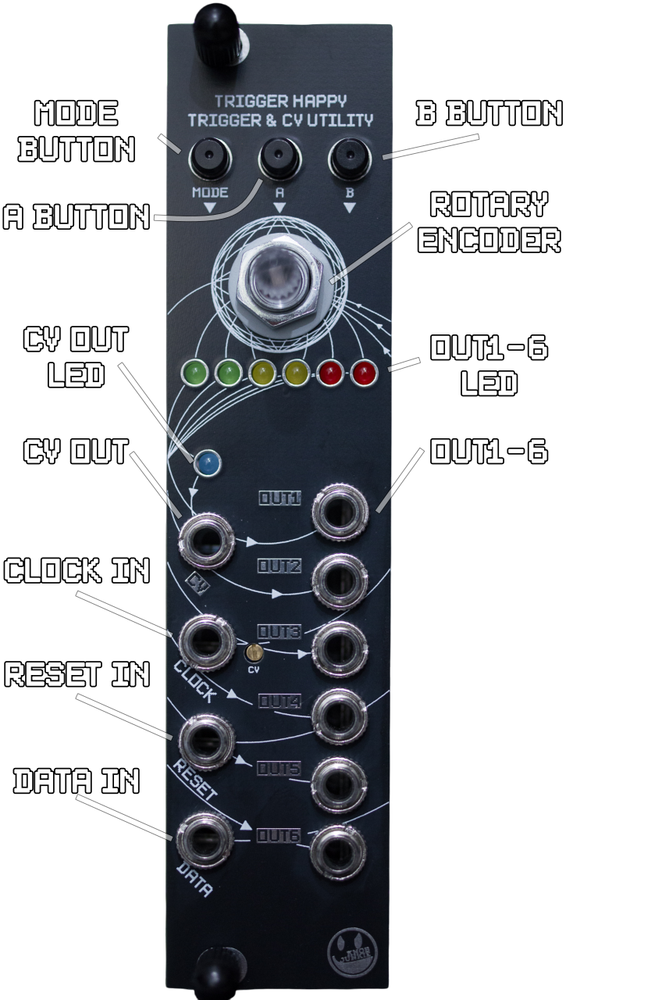
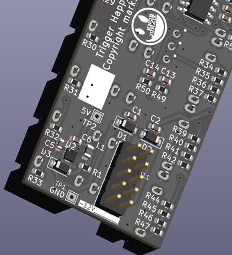
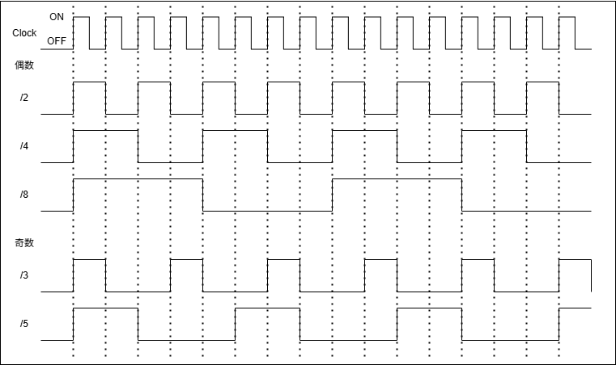
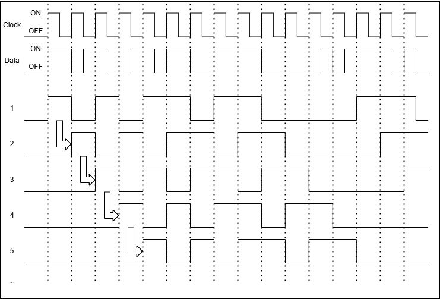
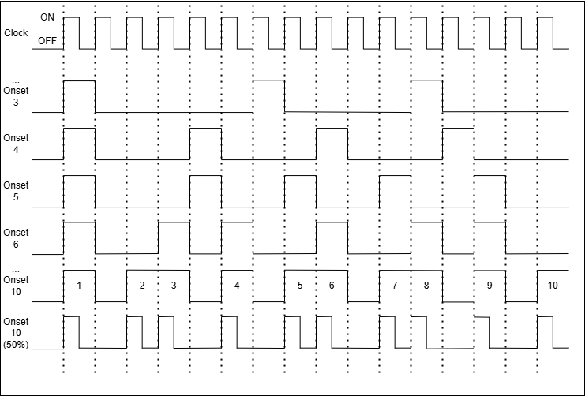
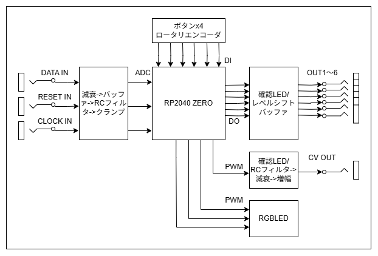
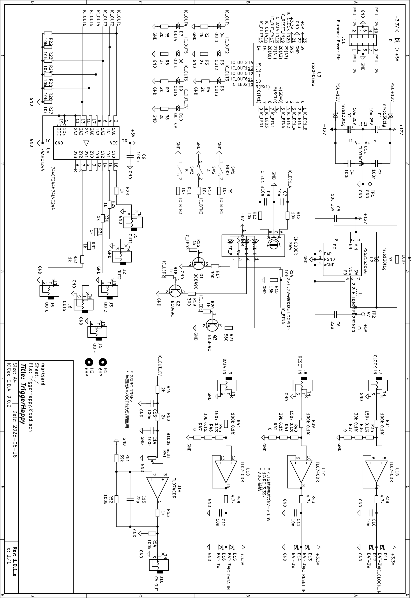

# TriggerHappy 操作マニュアル

## 目次

1. [はじめに](#1-はじめに)
2. [ハードウェア概要](#2-ハードウェア概要)
    - 2.1 [入出力端子](#21-入出力端子)
    - 2.2 [操作子](#22-操作子)
3. [基本操作](#3-基本操作)
    - 3.1 [電源投入と初期化](#31-電源投入と初期化)
    - 3.2 [アルゴリズム切り替え](#32-アルゴリズム切り替え)
    - 3.3 [パラメータの調整](#33-パラメータの調整)
4. [各アルゴリズムの詳細](#4-各アルゴリズムの詳細)
    - 4.1 [Clock Divider](#41-clock-divider-アルゴリズム)
        - 4.1.1 [機能概要](#411-機能概要)
        - 4.1.2 [入出力](#412-入出力)
        - 4.1.3 [操作方法](#413-操作方法)
        - 4.1.4 [LED表示](#414-led表示)
    - 4.2 [Shift Register](#42-shift-register-アルゴリズム)
        - 4.2.1 [機能概要](#421-機能概要)
        - 4.2.2 [入出力](#422-入出力)
        - 4.2.3 [操作方法](#423-操作方法)
        - 4.2.4 [LED表示](#424-led表示)
    - 4.3 [StepSeq Euclid](#43-stepseq-euclid-アルゴリズム)
        - 4.3.1 [機能概要](#431-機能概要)
        - 4.3.2 [入出力](#432-入出力)
        - 4.3.3 [操作方法](#433-操作方法)
        - 4.3.4 [LED表示](#434-led表示)
5. [共通設定モード](#5-共通設定モード)
    - 5.1 [設定可能な項目](#51-設定可能な項目)
    - 5.2 [設定モードでの操作方法](#52-設定モードでの操作方法)
6. [トラブルシューティング](#6-トラブルシューティング)
7. [仕様](#7-仕様)
8. [付録](#8-付録)
    - 8.1 [ファームウェアアップデート方法](#81-ファームウェアアップデート方法)
    - 8.2 [CV出力電圧調整方法](#82-cv出力電圧調整方法)
    - 8.3 [ハードウェアブロック図](#83-ハードウェアブロック図)
    - 8.4 [回路図](#84-回路図)
9. [免責事項](#9-免責事項)
10. [改版履歴](#10-改版履歴)

---

## 1-はじめに

TriggerHappyはRP2040マイコンを搭載したユーロラック・モジュール用の多機能トリガー／ゲート／CVジェネレーターです。  
本機はクロック分周、シフトレジスタ、ユークリッドリズム・シーケンサーなど複数のアルゴリズムを搭載し、ライブパフォーマンスやモジュラーシンセのリズム生成に柔軟に対応します。

このマニュアルでは、TriggerHappyの基本的な使い方から各アルゴリズムの詳細、設定方法までを解説します。

---

## 2-ハードウェア概要

### 2.1-入出力端子

  

    
  

  

<ul>
<li><b>クロック入力（CLOCK IN）</b></li>
  外部クロック信号を入力します。 
  2.5V程度でON、1.8V以下程度でOFFの動作になります。 
<li><b>リセット入力（RESET IN）</b></li>
  シーケンスや分周カウントのリセットに使用します。 
  2.5V程度でON、1.8V以下程度でOFFの動作になります。 
<li><b>データ入力（DATA IN）</b></li>
  CVやゲート信号など、各アルゴリズムでのパラメータ変調に利用されます。 
  0～5Vで動作します。トリガー／ゲートを扱う時は2.5V程度でON、1.8V以下程度でOFFの動作になります。 
<li><b>トリガー／ゲート出力（OUT1～OUT6）</b></li>
  各アルゴリズムで生成されたトリガー／ゲート信号を出力します。 
</ul>

### 2.2-操作子

- **ロータリーエンコーダ（押し込みボタン付き）**  
  パラメータの増減や選択、押し込みによりアルゴリズム切替を行います。

- **MODEボタン／Aボタン／Bボタン**  
  各種パラメータの変更やモード切替などを行います。

- **RGB LED（ロータリーエンコーダー内）**  
  現在の状態やパラメータを色と点滅でフィードバックします。

- **トリガー／ゲート、CV出力確認LED**  
  現在の出力状態を表示します。
  トリガー／ゲート出力はゲート長さの確認に、CV出力は明るさ変化である程度電圧状態を確認できます。  

- **CVトリムポット**  
  CV出力5V調整設定で使用します。

---

## 3-基本操作

### 3.1-電源投入と初期化

1. モジュールをユーロラックケースに取り付け、電源ケーブルを正しく接続してください。
2. ケースの電源をONにすると、TriggerHappyが起動します。
3. 起動時、RGB LEDが点灯し現在のアルゴリズムや状態を色で表示します。

  

下側が-12Vラインのピンです。  
正常なユーロラックシステムの電源とリボンケーブルの組み合わせであれば、リボンケーブルの赤いラインがあるほうに-12Vが流れています。  
赤いラインと-12Vのピンを接続してください。  

### 3.2-アルゴリズム切り替え

TriggerHappyは複数のアルゴリズムを搭載しています。  
アルゴリズムは以下の手順で切り替えます。

- **REボタン（エンコーダ押し込み）を短く押す**  
  → Clock Divider → Shift Register → StepSeq Euclid → Clock Divider → ... の順にアルゴリズムが切り替わります。
- アルゴリズム切り替え時、RGB LEDの色が変化し、現在のアルゴリズムを示します。

アルゴリズムに対するLEDの基本色は以下の通りです。  
この基本色からほかの設定要素で色が変化します。  

- Clock Divider：赤
- Shift Register 通常モード：緑
- Shift Register ランダム生成モード：白
- StepSeq Euclid ステップシーケンサ操作：青
- StepSeq Euclid Euclid1操作：シアン
- StepSeq Euclid Euclid2操作：マゼンタ
- StepSeq Euclid Euclid3操作：黄
- Setting Mode：黒（LED OFF）

### 3.3-パラメータの調整

各アルゴリズムごとに、ロータリーエンコーダやボタンを使って様々なパラメータを調整できます。

- **ロータリーエンコーダ回転**  
  選択中のパラメータ値を増減します（例：分周比、ステップ数、スケールなど）。  

- **MODE/A/Bボタンの単独押し・長押し・同時押し**  
  アルゴリズムごとに異なる機能が割り当てられています。  
  単独押しは押してから離したタイミングで入力完了になります。  
  250ミリ秒程度押し続けると長押し動作になります。  

- **LEDフィードバック**  
  パラメータ変更の操作時にRGB LEDの点滅と色で状態、現在値をフィードバックします。  
  ボタン長押し時はLEDが点滅します。点滅したら入力可能状態になります。  
  ボタン長押し＋ロータリーエンコーダー操作時、長押ししているボタンに割り当てられたパラメータの現在値を色表示します。  
  設定値の表示は赤色～白の最大16色のレインボーカラーで表現します。  
    
  左が設定値が低いとき。そこから右へ順に上記カラーへ変化します。  
  パラメータの設定幅によって色を自動で割り振って表示します。  
  ※変化がわかりにくいことがあります。  

---

## 4.-各アルゴリズムの詳細

### 4.1-Clock Divider アルゴリズム

#### 4.1.1-機能概要

Clock Divider（クロック分周）は、外部クロック信号を分割し、6系統のトリガー／ゲート出力として出力します。  
6系統のトリガー／ゲート出力は複数の分周パターンを切り替えることで偶数・奇数分周を出力します。  

##### タイミングチャート

  

Clock ONでカウントし、各出力は分割数にしたがってONになります。  

##### トリガーパルス幅

クロック入力間隔を100%としたパーセンテージ設定となります。  
初期設定は100です。  
100%の時はゲート設定（分割式に沿う形）となります。  

~~~c
const uint8_t _trigDurations[7] = {2, 8, 16, 32, 64, 80, 100}; // パーセント
~~~

##### 分周パターン

左よりOUT1,2,3,4,5,6の各分周数。  
縦の並びが各出力に割り当てるパターンです。  
初期設定は上から3つめ（/2, /4, /8, /16, /32, /64）です。  

~~~c
const uint8_t _divisions[6][OUT_COUNT]{
    {2, 3, 4, 5, 6, 7},
    {2, 4, 6, 8, 10, 12},
    {2, 4, 8, 16, 32, 64},
    {3, 4, 5, 6, 7, 8},
    {3, 5, 7, 9, 11, 13},
    {3, 6, 12, 24, 48, 96},
};
~~~

##### ステップシーケンサーCV

起動時に自動生成されます。  
ステップ数の初期設定は16です。  
ステップシーケンサーは3オクターブ範囲で生成されます（範囲は共通設定モードで変更可能）。  
演奏時のオクターブ加減算設定は2番目（±0位置）です。  

#### 4.1.2-入出力

- **入力**
    - クロック入力（CLOCK IN）：分周するクロック信号を受け取ります。
    - データ入力（DATA IN）：分周パターンを選択・変調します。
    - リセット入力（RESET IN）：分周カウンタやシーケンスをリセットします。

- **出力**
    - トリガー／ゲート出力（OUT1～OUT6）：分周パターンに基づいたトリガー／ゲート信号を出力します。
    - CV出力（CV OUT）：ステップシーケンサーのV/OCT電圧を出力します。

#### 4.1.3-操作方法

| 操作 | 機能・動作内容 |
|---|---|
| **Aボタン（単独押し）** | 分周カウントとステップシーケンサーのリセット |
| **Bボタン（単独押し）** | 分周カウントを1つ進める（手動クロック） |
| **MODEボタン（単独押し）** | （現状動作なし） |
| **REボタン（単独押し）** | アルゴリズムを切り替える |
| **MODE長押し+RE単独押し** | 共通設定モードに入る（別章） |
| **A+B同時長押し** | ステップシーケンス再生成要求 |
| **A長押し+ロータリーエンコーダー** | 分周パターンの切り替え（6段階） |
| **B長押し+ロータリーエンコーダー** | トリガーパルス幅の切り替え（7段階） |
| **MODE長押し+ロータリーエンコーダー** | ステップシーケンサーのオクターブ加減算設定（-1～+2の4段階） |
| **ロータリーエンコーダーのみ** | ステップシーケンサーのステップ数の変更（1～16） |

#### 4.1.4-LED表示

- **分周パターン**  
  レインボーカラーで分周パターンのインデックスを6段階表示

- **トリガーパルス幅**  
  レインボーカラーでパルス幅インデックスを7段階表示

- **ステップシーケンサーのオクターブ加減算設定**  
  ステップシーケンサーのオクターブ加減算設定を-1～+2の4段階表示

- **通常時**  
  以下の色がミックスされ、基本色との混色によって色が変化します  
   - アルゴリズム基本色：赤  
   - 分周カウント値リセット時の色：青  
   - ステップシーケンサのステップ終点・ステップ始点の色：緑  

  分周カウンタはリセット以降、カウンタが進むごとに青みを増します。

---

### 4.2-Shift Register アルゴリズム

#### 4.2.1-機能概要

Shift Register（シフトレジスタ）は、クロック入力ごとにデータ入力の状態を8bitのシフトレジスタに取り込み、そのビット列をもとに複数のトリガー／ゲート出力やCV出力を生成します。  

##### モード

このアルゴリズム内には以下のモードがあります。  

- **通常モード**
  クロック入力とDATA IN入力によってトリガービットをシフトレジスターに格納します。  
  CV出力はシフトレジスタに入った8bitのデータ値をV/OCT電圧に変換して出力します。  

- **ランダム生成モード**  
  DATA IN入力を無視し、クロック入力ごとに内部でランダムにトリガーを生成します。  
  CV出力も同時にランダムに生成します。  

##### タイミングチャート

  

（1ビットオリジンで表現しています）  
Clock OFF->ON時に1ビット目に入っている値(ON/OFF)を2ビット目へ、2ビット目に入っていた値は3ビット目へ…といようにずらしていき（ビットシフト）、1ビット目はクリアします。  
CLOCK ON中にDATAがONになれば、1ビット目はONになります。  

##### フリー／ビットローテーションについて

フリー時は8ビット目に入っていた値は捨てられますが、ビットローテーション時は8ビット目の値を1ビット目に入れるようになり、8ステップでループ再生されます。  

##### トリガーパルス幅

クロック入力間隔を100%としたパーセンテージ設定となります。  
初期設定は100です。  
100%の時はゲート設定（上記タイミングチャートに沿う形）となります。  

~~~c
const uint8_t _trigDurations[7] = {2, 8, 16, 32, 64, 80, 100}; // パーセント
~~~

##### ビット出力パターン

OUT1,2,3,4,5,6への割り当てるビットを決めます。1～8ビット目まで割り当てられます。  
初期設定はひとつめ（1, 2, 3, 4, 5, 6）で、この設定だとOUT1に1ビット目、OUT2に2ビット目…ということになります。  

~~~c
const uint8_t _shiftRegisterBits[6][OUT_COUNT] = {
    {1, 2, 3, 4, 5, 6},
    {1, 3, 5, 7, 1, 3},
    {3, 4, 5, 6, 7, 8},
    {8, 7, 6, 5, 4, 3},
    {7, 5, 3, 1, 7, 5},
    {6, 5, 4, 3, 2, 1},
};
~~~

##### CV出力

- **通常モード**
  CV出力はシフトレジスタに入った8bitのデータ値をV/OCT電圧に変換して出力します。  

- **ランダム生成モード**  
  CV出力も同時にランダムに生成します。  

CVオクターブ範囲の初期値は2オクターブです。  

#### 4.2.2-入出力

- **入力**
    - クロック入力（CLOCK IN）：シフト動作のタイミングを決定します。
    - データ入力（DATA IN）：クロック立ち上がりエッジでこのピンの状態をシフトレジスタに取り込みます。数100マイクロ秒程度データ入力が遅延していても受け付けます。
    - リセット入力（RESET IN）：シフトレジスタの内容を全てリセットします。

- **出力**
    - トリガー／ゲート出力（OUT1～OUT6）：シフトレジスタのビットやパターンに応じた信号を出力します。
    - CV出力（CV OUT）：モード内容をもとにスケールやオクターブ設定を反映したV/OCT電圧を出力します。

#### 4.2.3-操作方法

| 操作 | 機能・動作内容 |
|---|---|
| **Aボタン（単独押し）** | シフトレジスタのリセット|
| **Bボタン（単独押し）** | （通常モード時のみ）データ手動入力（シフトレジスタに反映）|
| **MODEボタン（単独押し）** | 通常モード、ランダム生成モード切り替え|
| **REボタン（単独押し）** | アルゴリズムを切り替える |
| **MODE長押し+RE単独押し** | 共通設定モードに入る（別章） |
| **A+B同時長押し** | （現状動作なし） |
| **A長押し+ロータリーエンコーダー** | シフトレジスタのビット出力パターンの切り替え（3段階） |
| **B長押し+ロータリーエンコーダー** | トリガーパルス幅の切り替え（7段階） |
| **MODE長押し+ロータリーエンコーダー** | CV出力のオクターブ範囲の切り替え（1oct範囲～5oct範囲の5段階） |
| **ロータリーエンコーダーのみ** | 時計回りでビットローテーション、反時計回りでフリー |

#### 4.2.4-LED表示

- **モード切り替え**  
  通常モード：緑  
  ランダム生成モード：白  

- **ビット出力パターン**  
  レインボーカラーで分周パターンのインデックスを3段階表示

- **トリガーパルス幅**  
  レインボーカラーでパルス幅インデックスを7段階表示

- **オクターブ範囲の切り替え**  
  レインボーカラーでCV出力のオクターブ範囲を1oct範囲～5oct範囲の5段階表示

- **通常時**  
  以下の色がミックスされ、基本色との混色によって色が変化します  
  通常モード  
   - アルゴリズム基本色：緑  
   - クロック入力エッジ：緑が明るくなります  
   - ビットローテーション時：赤

  ランダム生成モード  
   - アルゴリズム基本色、フリー時：白  
   - クロック入力エッジ：白が明るくなります
   - ビットローテーション時：赤

---

### 4.3-StepSeq Euclid アルゴリズム

#### 4.3.1-機能概要

このアルゴリズムは、パターンベースのジェネレイティブ16ステップシーケンサーのCV、ゲート、アクセント出力と、3基の16ステップユークリッドトリガーを備えています。  
ステップシーケンサーは設定されたオクターブの範囲でCVを、複数あるトリガーONパターンと設定されたゲート範囲をもとにランダム要素を加えることで、完全ランダムではないニュアンスのあるシーケンスを生成します。アクセント出力も活用すれば表現に幅が生まれます。  
ユークリッドトリガーは任意のステップ中（1～16ステップ）に設定されたON回数（1～16回）をバランスよく配置するアルゴリズムです。  
CVステップ数、ゲートステップ数、オンセット数、トリガー／ゲート⻑などを柔軟に設定することで多彩なリズムパターンやメロディックなシーケンスを簡単に作成できます。  

##### ユークリッドトリガータイミングチャート

  

このタイミングチャートは16ステップ幅に設定したときのチャートになります。  
Clock ONでカウントし、ステップ数とON回数に応じた間隔でON出力します。  

##### ユークリッドトリガーパルス幅

クロック入力間隔を100%としたパーセンテージ設定となります。  
初期設定は100です。  
100%の時はゲート設定（上記タイミングチャートに沿う形）となります。  

~~~c
const uint8_t _trigDurations[7] = {2, 8, 16, 32, 64, 80, 100}; // パーセント
~~~

##### ステップシーケンサーゲート幅

クロック入力間隔を100%としたパーセンテージ設定となります。  
ステップシーケンス生成時、0～100のトリガーをランダムに選ぶような初期設定となっています。  

~~~c
const uint8_t GateDuration[Gate::Max] = {0, 25, 50, 75, 100};
~~~

##### ステップシーケンサーアクセント幅

200ミリ秒固定です。  

##### ステップシーケンサーCV

起動時に自動生成されます。  
ステップ数の初期設定は16です。  
ステップシーケンサーは3オクターブ範囲で生成されます（範囲は共通設定モードで変更可能）。  
演奏時のオクターブ加減算設定は2番目（±0位置）です。  

#### 4.3.2-入出力

- **入力**
    - クロック入力（CLOCK IN）：シーケンスの進行タイミングを決定します。
    - データ入力（DATA IN）：ユークリッドトリガーのオンセット、ステップ数をCV値を元にランダム設定します。
    - リセット入力（RESET IN）：ステップシーケンス再生成要求を行います。

- **出力**
    - トリガー／ゲート出力（OUT1～OUT3）：ユークリッドトリガー信号を出力します。
    - トリガー／ゲート出力（OUT4）：ステップシーケンサーのゲート信号を出力します。
    - トリガー／ゲート出力（OUT5）：ステップシーケンサーのアクセント信号を出力します。
    - CV出力（CV OUT）：ステップシーケンサーのV/OCT電圧を出力します。

#### 4.3.3-操作方法

| 操作 | 機能・動作内容 |
|---|---|
| **Aボタン（単独押し）** | ステップシーケンサーのリセット |
| **Bボタン（単独押し）** | （現状動作なし） |
| **MODEボタン（単独押し）** | 設定モード切り替え：ステップシーケンサ設定→ユークリッドトリガー設定1→2→3→ステップ… |
| **REボタン（単独押し）** | アルゴリズムを切り替える |
| **MODE長押し+RE単独押し** | 共通設定モードに入る（別章） |
| **A+B同時長押し** | ステップシーケンス再生成要求 |
| **A長押し+ロータリーエンコーダー** | ステップシーケンサ設定時：ゲートステップ数の変更（1～16） ユークリッドトリガー設定時：オンセット数の変更（1～16） |
| **B長押し+ロータリーエンコーダー** | ステップシーケンサ設定時：ゲート長さの加算（-4～4の9段階） ユークリッドトリガー設定時：トリガーパルス幅の切り替え（7段階）|
| **MODE長押し+ロータリーエンコーダー** | ステップシーケンサーのオクターブ加減算設定（-1～+2の4段階） |
| **ロータリーエンコーダーのみ** | ステップシーケンサ設定時：ステップシーケンサーのステップ数の変更（1～16） ユークリッドトリガー設定時：ステップ数の変更（1～16） |

#### 4.3.4-LED表示

- **設定モード切り替え**  
  ステップシーケンサーと3基のユークリッドトリガーの設定操作を個別に行うモードです。押下ごとにモードが切り替わります  
  - StepSeq Euclid ステップシーケンサ操作：青
  - StepSeq Euclid Euclid1操作：シアン
  - StepSeq Euclid Euclid2操作：マゼンタ
  - StepSeq Euclid Euclid3操作：黄

- **ステップシーケンサ設定モード**
  - **ゲートステップ数の変更**  
    レインボーカラーでゲートステップ数の変更を16段階表示  

  - **ゲート長さの切り替え**  
    レインボーカラーでゲート長さの加算を-4～4の9段階表示  

  - **ステップシーケンサーのオクターブ加減算設定**  
    レインボーカラーでステップシーケンサーのオクターブ加減算設定を-1～+2の4段階表示

- **ユークリッドトリガー設定**  
  - **オンセット数の変更**  
    レインボーカラーでオンセット数の変更を16段階表示  

  - **トリガーパルス幅の切り替え**  
    レインボーカラーでパルス幅インデックスを7段階表示

- **通常時**  
  以下の色がミックスされ、基本色との混色によって色が変化します  
  ステップシーケンサ設定モード  
   - アルゴリズム基本色：青  
   - ステップシーケンサのステップ終点・ステップ始点の色：緑  

  ユークリッドトリガー設定  
   - アルゴリズム基本色：シアン、マゼンタ、黄
   - オンセットエッジ：赤
   - ユークリッドステップ始点：緑

---

## 5.-共通設定モード

各アルゴリズム、各アルゴリズム内の各モードによらず、共通した設定を行えます。  
LEDの基本色は黒（消灯）です。  

### 5.1-設定可能な項目

- **内部クロック／外部クロックの切り替え**  
  内部クロックを使用するか、外部クロック入力を使用するかを選択できます。  
  初期設定は外部クロック入力です。  

- **CV出力のスケール変更**  
  CV出力のスケールの変更が出来ます。
  初期設定はマイナーです。

- **ステップシーケンサーのオクターブ最大値設定**  
  ステップシーケンサー生成時のオクターブ範囲を変更できます（1oct範囲～5oct範囲の5段階）。  
  初期設定は3オクターブです。

- **ステップシーケンサーへ入力するクロックの分割数設定**  
  クロック入力に対してステップシーケンサー機能だけ速度を半分以下に設定変更できます。  
  初期設定は/1（クロックそのまま）  

#### 内部クロック仕様

  - 各アルゴリズムでのOUT6は内部クロック出力になります。  
  - 各アルゴリズムでの **Aボタン（単独押し）** は内部クロックのスタート・ストップ（リセット）ボタンになります。
  - テンポ設定は共通設定モードで行えます。

### 5.2-設定モードでの操作方法

| 操作 | 機能・動作内容 |
|---|---|
| **Aボタン（単独押し）** | 内部クロック・外部クロック切り替え |
| **Bボタン（単独押し）** | ステップシーケンサーへ入力するクロックの分割数切り替え（/1～/4） |
| **MODEボタン（単独押し）** | （現状動作なし） |
| **REボタン（単独押し）** | （現状動作なし） |
| **MODE長押し+RE単独押し** | 共通設定モードから抜ける |
| **A+B同時長押し** | （現状動作なし） |
| **A長押し+ロータリーエンコーダー** | ステップシーケンサーCV、シフトレジスターCVのスケール設定（メジャー、マイナー） |
| **B長押し+ロータリーエンコーダー** | ステップシーケンサーのオクターブ最大値の切り替え（1～5）|
| **MODE長押し+ロータリーエンコーダー** | （現状動作なし） |
| **ロータリーエンコーダーのみ** | 内部クロックのテンポ変更（0～255） |

---

## 6.-トラブルシューティング

TriggerHappyを使用中に問題が発生した場合は、以下の項目を参考に対処してください。

### 6.1-電源が入らない／LEDが点灯しない

- ユーロラックケースの電源が正しく接続されているか確認してください。
- 電源ケーブルの向きや接続ミスがないか確認してください（逆接続に注意）。
- 他のモジュールで電源が正常に供給されているか確認してください。
- RP2040 Zeroが正しく接続されているか確認してください。

### 6.2-クロックやトリガー出力が出ない

- 外部クロック入力（CLOCK IN）が正しく接続されているか確認してください。
- クロック信号のレベルやパルス幅が適切か確認してください。
- アルゴリズムや分周パターン、出力設定が正しいか確認してください。
- 接続先モジュールが高い電圧でしか入力を受け付けない場合があります。

### 6.3-CV出力が期待通りにならない

- CV OUT端子が正しく接続されているか確認してください。
- スケールやオクターブ設定が意図したものになっているか確認してください。
- 各アルゴリズムでのCV出力設定を見直してください。
- 接続先モジュールがパッシブスプリッターや低インピーダンス入力の場合、正しい値の電圧を送れない場合があります。

### 6.4-ボタンやエンコーダが反応しない

- ボタンやエンコーダに物理的な引っかかりや破損がないか確認してください。
- ファームウェアが正常に動作しているか、再起動してみてください。

### 6.5-LED表示が異常／操作ができない

- ファームウェアのバージョンや設定モードを確認してください。
- 設定モードに入っていないか、または設定モードから正常に戻れているか確認してください。
- 必要に応じて電源を入れ直してください。

### 6.6-ファームウェアアップデート後に動作しない

- ファームウェアが正しく書き込まれているか再確認してください。
- 書き込み手順や対応バージョンを再度ご確認ください。

---

#### それでも解決しない場合

- 開発者（@marksard）にお問い合わせください。boothの購入された商品ページにある「ショップへのお問い合わせ」からお願いいたします。またXやBlueskyでもリプライいただければ対応いたします。  
- その際は不具合内容、再現方法などをできるだけ詳しく伝えてください。

---

## 7.-仕様

| 項目 | 内容 |
|---|---|
| 幅 | ユーロラック規格：6HP |
| 深さ | 300mm（パネル面から） |
| メインプロセッサ | RP2040 （Waveshare RP2040 ZEROを使用） |
| 電源 | ユーロラック規格 ±12V（2x5pin） +5Vはモジュール基板上で生成 +3V3はRP2040 ZERO基板上で生成 |
| 消費電流 | +12V：22mA -12V：4mA |
| クロック入力 | 1系統（CLOCK IN） 認識可能入力範囲：0～5V(±1%) 入力インピーダンス：100kΩ |
| リセット入力 | 1系統（RESET IN） 認識可能入力範囲：0～5V(±1%) 入力インピーダンス：100kΩ |
| データ入力 | 1系統（DATA IN） 認識可能入力範囲：0～5V(±1%) 入力インピーダンス：100kΩ |
| トリガー/ゲート出力 | 6系統（OUT1～OUT6） 出力：0 or 5V(±1%) 出力インピーダンス：1kΩ |
| CV出力 | 1系統（OUT_CV） 1V/Oct対応 出力範囲：0～5V（調整器付） 出力インピーダンス：1kΩ |
| 操作子 | ロータリーエンコーダ（押し込み可）/ A / B / MODE |
| LED | RGB LED（状態・パラメータ表示用） 出力確認LED（OUT1～6、CV） |
| アルゴリズム | Clock Divider / Shift Register / StepSeq Euclid |
| ファームウェア更新 | USB経由で書き換え可能（UF2） |

※RP2040 ZEROのGPIO出力で使用している3V3の出力電圧値に依存するため、RP2040 ZERO交換時にCV出力電圧を再調整する必要があります。  
※出力電圧・出力電流、消費電流については出力へ接続した負荷により変動する場合があります。  

---

## 8.-付録

### 8.1-ファームウェアアップデート方法

1. ユーロラック電源コネクタを取り外します。
2. RP2040 ZEROのUSB端子をPCに接続します。
3. RP2040 ZEROについているBOOTボタンを押しながらRESETボタンを押し、RESETボタンを離すとUSBドライブとして認識されます。
4. 最新のファームウェア（.uf2ファイル）をドラッグ＆ドロップしてください。
5. 書き込み後、自動的に再起動します。

### 8.2-CV出力電圧調整方法

1. ユーロラック電源コネクタを取り付けます。
2. MODEボタンを押しながら電源を入れます。
3. メンテナンスモードで立ち上がります（電源投入時LEDがピンク色になります）
4. エンコーダーを操作すると12半音単位でCVが可変し、1オクターブごとにLEDがピンクになります。
5. 60クリック分回して最大電圧（最高音）にします。
6. CV出力に電圧計を接続します。
7. CVトリムポット（パネル中央付近の金色のマイナスネジ）を回して5000mVになるように調整します。
8. エンコーダー押し込みでメンテナンスモードを抜けます。

### 8.3-ハードウェアブロック図

  

### 8.4-回路図

  

---

## 9.-免責事項

### 品質・動作保証について

本モジュールは十分な検証を行っておりますが、全ての環境において正常に動作することを保証するものではありません。  
本モジュールの使用によって発生したいかなる損害（直接的・間接的を問わず）について、開発者および販売者は責任を負いません。  

### 技術的サポートについて

本モジュールに関するサポートは可能な範囲で提供しますが、商業製品のような継続的なサポートや保証をお約束するものではありません。  
お問い合わせへの対応は任意で行われ、必ずしもすべての問題に対応できるとは限りません。  

### 安全性について

本モジュールは十分な注意をもって設計されていますが、使用環境や誤った取り扱いによって事故が発生する可能性があります。  
適切に注意を払い自己責任にてご使用ください。  

### 免責事項の変更について

必要に応じて免責事項を変更する場合があります。  

---

## 10.-改版履歴
- 2025-06-23 初版
- 2025-07-23 加筆・修正

<footer style="text-align:center; font-size:12px; margin-top:50px;">
TriggerHappy Operation Manual  © 2025 by marksard.
</footer>
